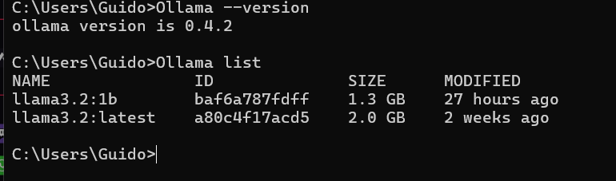

# Reformas mediante Ollama

## Introducción y configuración del modelo

Para la construcción de este proyecto se realizo en el sistema operativo Windows 11 mediante el launcher de Ollama para poder descargar los modelos disponibles que ofrece Meta, de manera gratuita y de ejecución local.

[Ollama](https://ollama.com/)

Así Mismo se descargo el Gestor AnythingLLM para utilizar una GUI mucho mas sencilla de utilizar con los modelos ejecutados en la computadora localmente.

[AnythingLLM | The all-in-one AI application for everyone](https://anythingllm.com/)

Para este proyecto en especifico se utilizo el modelo Llama 3.2 de 1b el cual es de los mas ligeros de Ollama.




Una vez configurado el entorno mediante los pasos guiados de Anything LLM ya tenemos integrado nuestro modelo con una interfaz visual para hacer consultas.


<aside>
💡

Posterior a la configuración inicial del modelo ahora se busca que el modelo nos pueda ayudar en la fundamentación sobre la Reforma al Poder Judicial y Organismos Autónomos  ofreciendo información general de este tema. Para esto debemos alimentar al modelo con una cantidad considerable de información respecto a estos temas. Esto se realizara mediante el scrapeo de Portales web, recolección de información de documentos PDF oficiales y la conversión de Voz a Texto de Debates oficiales y profesionales respecto al tema.

</aside>

## Recolección de datos para alimentar el modelo

La recopilación de los datos se llevo de 3 manera listadas a continuación quizás 4 si contamos el llenado a mano de algunos documentos que no permitían su descarga.

### Recopilación de información mediante documentos PDF oficiales

Gran parte de la información parte de los documentos oficiales emitidos por el gobierno de Mexico respecto a los temas de interés de este proyecto


Una vez que se seleccionaron los documentos mediante un script se realiza la extracción ordenada y estructurada del texto en un archivo TXT, que como se vera a lo largo del proyecto es donde se adjunta toda la información final.

```python
#Este es un codigo de extracción de PDF pero se tiene que cambiar dependiendo del PDF utilizado puesto que la estructura de sus titulos, subtitulos y referencias puede varias
import os
import re
from PyPDF2 import PdfReader

# Metadatos del documento
titulo = "Reforma integral al sistema de justicia en México: desafíos y propuestas"
fuente = "https://www.scjn.gob.mx/sites/default/files/agenda/documento/2024-09/reforma-integral-al-sistema-de-justicia-en-mexico.pdf"
fecha = "09/2024"
resumen = (
    "La Suprema Corte de Justicia de la Nación, consciente de la importancia de que la sociedad civil "
    "conozca qué es el Poder Judicial de la Federación y cuál es su funcionamiento, ha decidido publicar, "
    "por cuarta vez, la obra ¿Qué es el Poder Judicial de la Federación?, cuya aceptación por el foro y el "
    "público en general ha sido patente desde 1999, año de su primera edición. [...]"
)

# Ruta del archivo PDF
ruta_archivo = "./Documentos PDF/Analisis de la iniciativa de reforma al poder judicial.pdf"
archivo_salida = "documentos_integrados.txt"

# Página inicial
pagina_inicial = 4

def limpiar_texto_extraido(texto):
    """
    Limpia el texto extraído de un PDF para eliminar ruido y mejorar la legibilidad.
    Aplica formateo a títulos, subtítulos y sub-subtítulos.
    """

    # Eliminar pie de página específico
    texto = re.sub(r'Reforma integral al sistema de justicia en México: desafíos y propuestas', '', texto, flags=re.IGNORECASE)

    # Detectar títulos (líneas solitarias largas, asumidas como encabezados grandes)
    texto = re.sub(r'^\s*(.{20,})\s*$', r'\n=== TÍTULO: \1 ===\n', texto, flags=re.MULTILINE)

    # Detectar subtítulos (letras seguidas de punto, con texto en negritas)
    texto = re.sub(r'^\s*([A-Z])\.\s*(.+)', r'\n--- SUBTÍTULO: \1. \2 ---\n', texto, flags=re.MULTILINE)

    # Detectar sub-subtítulos (números romanos seguidos de un punto)
    texto = re.sub(r'^\s*(I{1,3}|IV|V|VI|VII|VIII|IX|X)\.\s*(.+)', r'\n--- SUB-SUBTÍTULO: \1. \2 ---\n', texto, flags=re.MULTILINE)

    # Eliminar líneas vacías repetidas
    texto = re.sub(r'\n\s*\n', '\n', texto)

    # Eliminar espacios innecesarios
    texto = texto.strip()
    return texto

def extraer_texto_desde_pdf(ruta_archivo, pagina_inicial):
    """
    Extrae texto de un archivo PDF a partir de una página específica y salta cuando detecta números pequeños
    al inicio de una línea seguida de texto.
    """
    try:
        lector = PdfReader(ruta_archivo)
        texto = ""
        for i in range(pagina_inicial - 1, len(lector.pages)):
            pagina = lector.pages[i].extract_text()

            # Saltar página si detecta números pequeños al inicio de una línea seguidos de texto
            if re.search(r'^\s*[¹²³⁴⁵⁶⁷⁸⁹⁰].+', pagina, re.MULTILINE):
                continue 
            
            texto += pagina + "\n"
        return limpiar_texto_extraido(texto.strip())
    except Exception as e:
        print(f"Error al leer el PDF: {e}")
        return None

def agregar_al_archivo_texto(archivo_salida, titulo, fuente, fecha, contenido, resumen):
    """
    Agrega un nuevo documento al archivo de texto con el formato definido.
    """
    with open(archivo_salida, "a", encoding="utf-8") as f:
        f.write("====== NUEVO DOCUMENTO ======\n")
        f.write(f"TÍTULO: {titulo}\n")
        f.write(f"FUENTE: {fuente}\n")
        f.write(f"FECHA: {fecha}\n\n")
        f.write("CONTENIDO:\n")
        f.write(contenido + "\n")
        f.write("------------------------\n")
        f.write("NOTAS/RESUMEN:\n")
        f.write(resumen + "\n")
        f.write("====== FIN DOCUMENTO ======\n\n")

def main():
    # Verificar si el archivo PDF existe
    if not os.path.isfile(ruta_archivo):
        print(f"El archivo PDF '{ruta_archivo}' no existe. Verifica la ruta.")
        return
    
    # Extraer texto del PDF desde la página indicada
    contenido = extraer_texto_desde_pdf(ruta_archivo, pagina_inicial)
    if not contenido:
        print("No se pudo extraer el texto del archivo. Intenta con otro archivo.")
        return
    
    # Agregar contenido al archivo de salida
    agregar_al_archivo_texto(archivo_salida, titulo, fuente, fecha, contenido, resumen)
    print(f"Documento '{titulo}' agregado exitosamente al archivo de salida: {archivo_salida}")

if __name__ == "__main__":
    main()

```


Una vez termina la extracción de los datos se estructura en el TXT de la siguiente manera, insertando metadatos que ayuden a clarificar al modelo de que se esta hablando en ese momento.


### Recolección de datos mediante extracción de texto en base a voz de videos

Otra parte considerable de la información se extrajo de medios oficiales que han debatido y hablado al respecto.

[Celebra CIDH audiencia pública para analizar reforma judicial en México.](https://www.youtube.com/watch?v=iXv_tV-xwSM)

Para el procesamiento de estos datos se descargo primero el audio de estos videos.


Posteriormente mediante un script de python y el modelo de Speech To Text de OpenIA Whisper se extrajo el debate a texto con un formato especifico al igual que la información anterior.

```python
import whisper

# Configuración de metadatos
TITULO = "Audiencia ante la Comisión Interamericana de Derechos Humanos. México"
FUENTE = "https://www.youtube.com/watch?v=GonCN4PuT-Q&t=1697s"
FECHA = "12/10/2024"

# Ruta del archivo MP3 y salida
ruta_audio_mp3 = "./ScrapVideo/InteramericanadeDerechosHumanos.mp3"
ruta_salida = "Audienciavid.txt"
# Cargar el modelo de Whisper
print("Cargando el modelo de Whisper...")
modelo = whisper.load_model("base")

# Transcribir el audio
print("Transcribiendo el audio...")
resultado = modelo.transcribe(ruta_audio_mp3, language="es")

# Crear archivo TXT con metadatos
print("Guardando la transcripción en un archivo...")
with open(ruta_salida, "w", encoding="utf-8") as archivo:
    archivo.write("====== NUEVO DOCUMENTO ======\n")
    archivo.write(f"TÍTULO: {TITULO}\n")
    archivo.write(f"FUENTE: {FUENTE}\n")
    archivo.write(f"FECHA: {FECHA}\n\n")
    archivo.write(resultado["text"])

print(f"Transcripción completa guardada en {ruta_salida}")

```

Al final podemos observar como extrae la información para poder agregarla al documento principal


### Recolección de datos mediante scrapeo de portales de noticias

Por ultimo las fuentes mas consultadas fueron diferentes paginas web de portales de noticias que tuviesen información veras de los temas relacionados

[](https://www.debate.com.mx/politica/Senado-aprueba-reforma-que-elimina-7-organismos-autonomos-funciones-pasan-al-Ejecutivo-20241129-0037.html?utm_source=chatgpt.com)

Para la extracción de esta información se realizo un scrapper de python sencillo utilizando BeautifullSoup con el mismo formato que las generaciones antes listadas

```python
import requests
from bs4 import BeautifulSoup
from datetime import datetime

# URL de la página que deseas scrapear
url = "https://politica.expansion.mx/mexico/2024/12/06/desaparicion-organismos-autonomos-trabajadores"

# Guardar el texto en un archivo TXT
output_path = "articulo_extraido28.txt"
# Realizar la solicitud HTTP para obtener el contenido HTML
response = requests.get(url)

if response.status_code == 200:  # Verifica que la solicitud fue exitosa
    html_content = response.text

    # Parsear el contenido HTML con BeautifulSoup
    soup = BeautifulSoup(html_content, "html.parser")

    # Extraer el título del artículo
    title = soup.find("title").get_text(strip=True) if soup.find("title") else "Título no disponible"

    # Extraer la fecha si está disponible
    date_meta = soup.find("meta", {"name": "article:published_time"})
    date = date_meta["content"] if date_meta else datetime.now().strftime("%Y-%m-%d")

    # Extraer el contenido del artículo (evitando comerciales)
    article_paragraphs = soup.find_all("p")
    article_text = "\n".join(paragraph.get_text(strip=True) for paragraph in article_paragraphs if paragraph.get_text(strip=True))

    # Crear el contenido con metadatos
    document_content = f"""====== NUEVO DOCUMENTO ======
TÍTULO: {title}
FUENTE: {url}
FECHA: {date}

{article_text}

====== FIN DOCUMENTO ======
"""
    with open(output_path, "w", encoding="utf-8") as output_file:
        output_file.write(document_content)

    print(f"Artículo extraído y guardado en {output_path}")
else:
    print(f"No se pudo acceder a la página. Código de estado HTTP: {response.status_code}")

```

Este código nos genera la siguiente salida la cual se hace de manera individual y no se adjunta directamente  al documento final puesto que pasa por una revisión manual que no se hayan agregado anuncios o información no relacionada que pueda tener la pagina web.


<aside>
🔥

Estas fueron las fuentes utilizadas para la extracción de información, posteriormente toda esta información se adjunto en el archivo de texto “Reforma judicial y de organismos autónomos” la cual cuenta con aproximadamente 1.5 millones de palabras de información estructurada y filtrada.

</aside>

## Especificación de información al modelo

Para otorgarle este contexto de información al modelo para que conteste nuestras preguntas nos serviremos de la interfaz grafica de AnythingLLM la cual nos permite adjuntar archivos de información que el modelo utilice para responder.


El propósito de este proyecto es que nuestro proyecto sea capaz de responder preguntas correspondientes a los temas designados como las siguientes.


Podemos ver como contesta las preguntas en base al documento insertado.


Como podemos observar aquí nos cita esta información, respecto al documento que adjuntamos anteriormente al modelo.


## Respuestas en base a la fundamentación de Ollama

### **Preguntas para la Ley del Poder Judicial**

1. ¿El diagnóstico de la ley al poder judicial es conocido y qué estudios
expertos se tuvieron en cuenta?

    Según lo visto en la audiencia ante la CIDH si bien no se dice nada directamente no parece existir un diagnostico reciente que justifique el porque de la reforma, puesto que los representantes de gobierno solo mencionan que ya se han hecho estudios de ello en el pasado sin mencionar ninguno en concreto.

    A su vez los estudios de expertos son aquellos que evidencian faltas a la justicia y liberación de criminales sin mencionar nada especifico al respecto.

2. ¿Por qué la reforma no incluyó a las fiscalías y a la defensoría, limitándose solo al poder judicial?

    La posición del gobierno mexicano respecto a esto parece ser debido a una planeación de futuras reformas complementarias que incluyan a estos organismos.

3. ¿Qué medidas concretas se implementarán para evitar la captación del
crimen organizado y la violencia en el contexto electoral?

    No parece haber mención de nuevas medidas para evitar la captación o infiltración del crimen organizado en el sistema judicial solo se citan medidas implementadas en el 2021 para evitar la captación y ofrecer protección del crimen organizado a los candidatos de elecciones populares

4. ¿Cómo garantizar que juristas probos y honestos se animen a competir
públicamente frente a los riesgos de la violencia?

    Al igual que la pregunta anterior el INE y los comunicados del Gobierno de Mexico indican que habrá medidas de protección para los candidatos como proporción de escoltas  y seguridad durante los mítines de campaña pero ningún comunicado actual

5. ¿Cómo se conforman los comités de postulación?

    Los Comités de Evaluación, estarán integrados por cinco miembros designados por cada uno de los tres Poderes de la Unión: Ejecutivo, Legislativo y Judicial. Estos comités son responsables de evaluar y seleccionar a los candidatos para los cargos de jueces, magistrados y ministros que serán elegidos por voto popular.

6. ¿Cómo asegurar la carrera judicial?

    Con las nuevas medidas de la reforma como la elección popular y la selección por parte de un comité designado provoca una gran incertidumbre y poca continuidad a la carrera judicial lo cual podría afectar profundamente a los profesiónistas relacionados.

7. ¿Cómo compatibilizar la incorporación de medidas para preservar la
identidad de los jueces (conocidos en el sistema interamericano como
"jueces sin rostro") con los estándares internacionales?

    En general según estudios realizados en casos contra Perú, la Corte IDH determinó que los "jueces sin rostro" vulneran el derecho a un juicio justo y público, de los jueces sin rostros muchos casos han presentado que tienen mas afectaciones que beneficios y puede considerarse que es completamente incompatible con los estándares internacionales.

8. ¿Cómo impactará el costo económico de esta reforma en la promoción
y el acceso a la justicia?

    Dado que se han programado recortes presupuestales para 2025 a la cámara de diputados y al poder judicial estas medidas podrían reducir la eficiencia de los organismos, además en cuestión económica general estas reformas han causado mucha incertidumbre y desconfianza a inversores que aporten a la economía mexicana además de los múltiples despidos que puede generar esta reforma a los organismos legales.

### Preguntas para la reforma a los organismos autónomos

1. ¿Es constitucional esta ley, considerando que algunos organismos autónomos
están establecidos en la Constitución?

    Como tal la reforma no se considera anticonstitucional puesto que la constitución permite su propia modificación siempre y cuando la pruebe el congreso de la union y la validación de al menos 17 congresos locales.

2. ¿Cómo afectaría la eliminación de estos organismos a la transparencia
y rendición de cuentas del gobierno?

    Puede afectar a la rendición de cuentas debido a que el mismo gobierno encargarse de la verificación de su propia legitimidad puede ser bastante poco confiable puesto que es susceptible a manipulaciones.

3. ¿Qué funciones críticas podrían perder independencia y control al pasar
al poder ejecutivo u otras instituciones?

    El principal afectado en todo esto es la parte de la desaparición del INAI puesto que no se han mencionado medidas respecto a el acceso a la información y protección de datos personales de los ciudadanos ademas el IFT, responsable de regular las telecomunicaciones y la radiodifusión, será reemplazado por una nueva Agencia de Transformación Digital. Aunque se promete independencia técnica, la ausencia de autonomía constitucional

4. ¿Existen alternativas para mejorar la eficiencia de los organismos autónomos
sin eliminarlos.

    Para mejorar la eficiencia de los organismos autónomos en México sin eliminarlos se pudieron proponer alternativas como la modernización institucional, la optimización de recursos mediante la revisión de estructuras y la colaboración interinstitucional, la implementación de tecnologías digitales, la capacitación continua del personal, el fomento de la participación ciudadana a través de mecanismos de gobierno abierto, en general habia mejores alternativas

5. ¿Qué sectores de la sociedad civil y grupos de interés se verían afectados
por la desaparición de estos organismos?

    La desaparición de organismos autónomos en México afecta a diversos sectores, incluyendo a la ciudadanía en general, que podría enfrentar limitaciones en el acceso a la información y protección de datos personales también al sector empresarial, que podría experimentar un entorno menos competitivo y transparente; a organizaciones de la sociedad civil, que verían reducida su capacidad de vigilancia y denuncia; a consumidores, que podrían sufrir aumentos de precios y disminución en la calidad de bienes y servicios; y a académicos e investigadores, que tendrían menos acceso a datos y evaluaciones cruciales para el análisis de políticas públicas.
